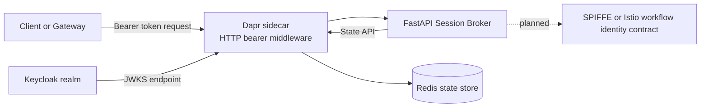
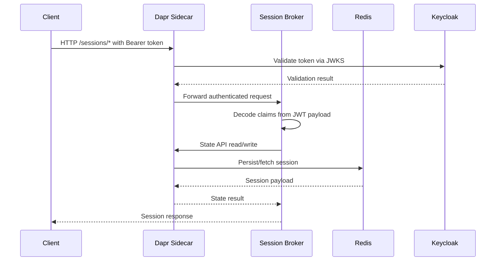

# Architecture Overview

Session Broker is a FastAPI microservice deployed on Kubernetes with a Dapr sidecar and integrated with Keycloak and Redis.

## Implementation status

- **Implemented now**: authenticated session lifecycle (`/sessions`) backed by Redis via Dapr state store.
- **Planned next**: token brokerage endpoints (`/auth/callback/cache`, `/identity/resolve`) for workflow identity conversion.

## Component diagram

## Runtime flows

### A) Current flow: authenticated session lifecycle

1. Caller sends request to `/sessions` endpoints with bearer token.
2. Dapr bearer middleware validates token signature and claims against Keycloak JWKS.
3. Broker decodes claims (`sub`, `email`, `realm_access.roles`) for application logic.
4. Broker reads/writes session documents in Redis through Dapr state APIs.

### B) Planned flow: callback cache + identity resolve

1. Keycloak callback stores token set by channel identity key.
2. Chat event calls identity resolution endpoint.
3. Broker resolves auth context and returns workflow identity contract.

## Sequence (current implementation)

## Responsibilities

| Layer | Responsibility |
|---|---|
| Keycloak | Token issuer and JWKS source for Dapr bearer validation |
| Dapr sidecar + state API | HTTP middleware validation and Redis abstraction |
| FastAPI broker | Session create/read/update/handoff/terminate operations |
| Redis | Session state storage keyed by session ID |
| Istio/SPIFFE | Target integration for planned identity-conversion contract |
| Argo CD | Delivers manifests from `gitops/` to the cluster |
