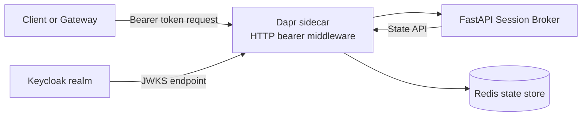
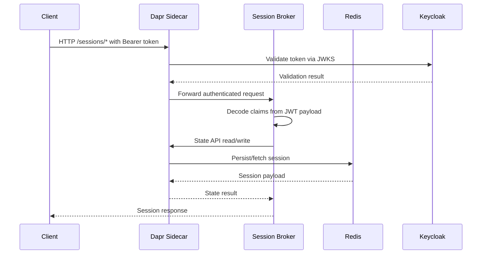

# Architecture Overview

Session Broker is a FastAPI microservice deployed on Kubernetes with a Dapr sidecar and integrated with Keycloak and Redis.

## Implementation status

- **Implemented (demo)**: token brokerage endpoints — `POST /auth/callback/cache` stores the user's token set; `POST /identity/resolve` returns the user's access token plus identity claims.
- **Implemented**: authenticated session lifecycle (`/sessions`) backed by Redis via Dapr state store.

## Component diagram

## Runtime flows

### A) Current flow: authenticated session lifecycle

1. Caller sends request to `/sessions` endpoints with bearer token.
2. Dapr bearer middleware validates token signature and claims against Keycloak JWKS.
3. Broker decodes claims (`sub`, `email`, `realm_access.roles`) for application logic.
4. Broker reads/writes session documents in Redis through Dapr state APIs.

### B) Demo flow: callback cache + identity resolve

1. Keycloak callback stores the user's token set by Slack user ID (trusted write via `POST /auth/callback/cache`).
2. Authorized caller invokes `POST /identity/resolve` with the Slack user ID.
3. Broker returns the user's access token plus identity claims so the caller can act as the user.

## Sequence (current implementation)

## Responsibilities

| Layer | Responsibility |
|---|---|
| Keycloak | Token issuer and JWKS source for Dapr bearer validation |
| Dapr sidecar + state API | HTTP middleware validation and Redis abstraction |
| FastAPI broker | Token cache write/read (`/auth/callback/cache`, `/identity/resolve`) and session lifecycle operations |
| Redis | Token and session state storage via Dapr state store |
| Argo CD | Delivers manifests from `gitops/` to the cluster |
