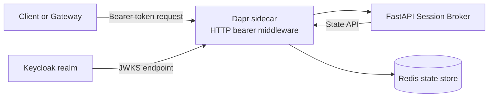
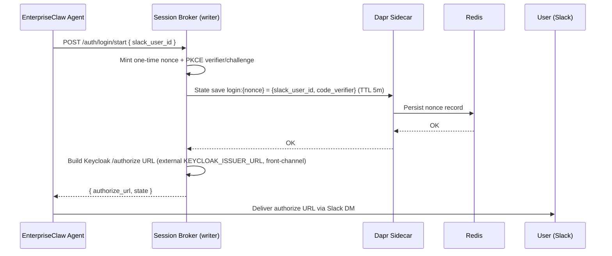
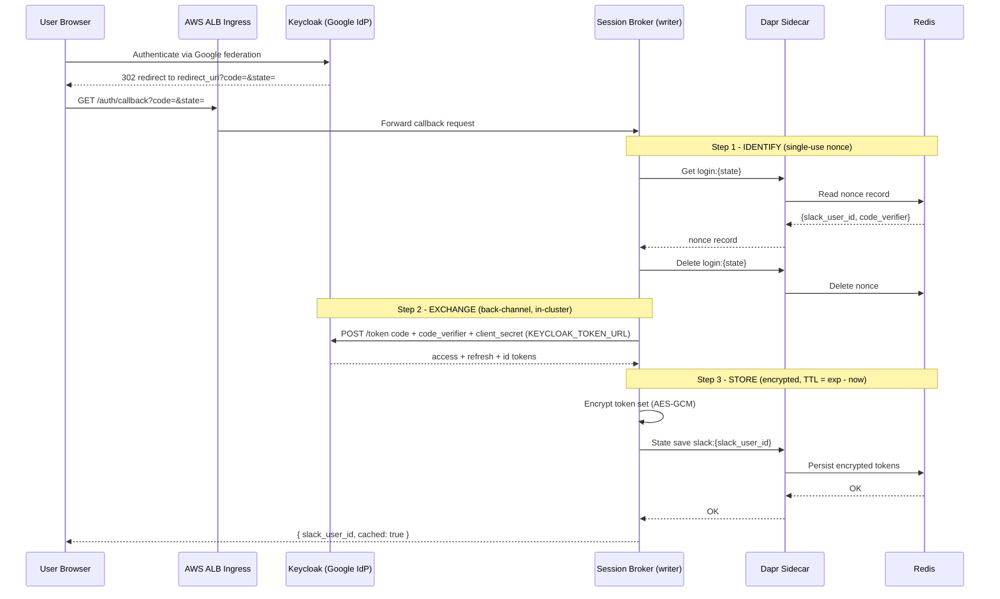
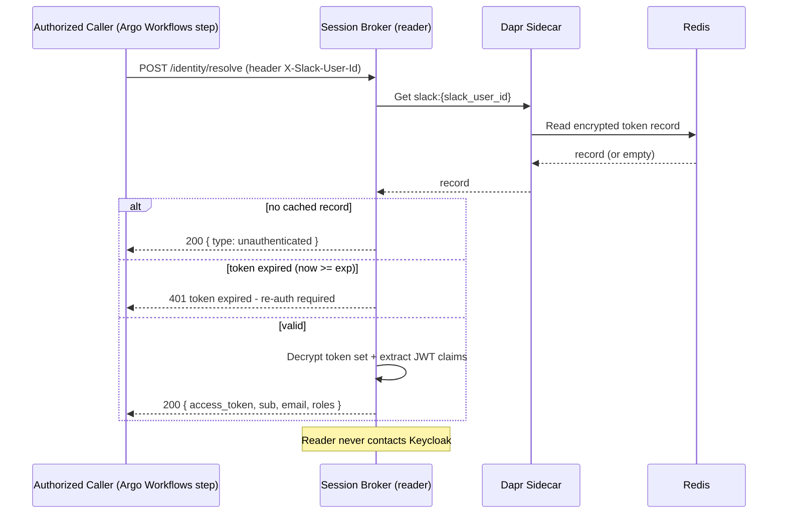

# Architecture Overview

Session Broker is a FastAPI microservice deployed on Kubernetes with a Dapr sidecar and integrated with Keycloak and Redis.

## Implementation status

- **Implemented (demo — real OAuth Authorization-Code write path)**: `POST /auth/login/start` mints a one-time `state` nonce + PKCE pair and returns the Keycloak `/authorize` URL; `GET /auth/callback` runs identify → exchange → store; `POST /identity/resolve` returns the user's access token plus identity claims.
- **Retained as a test shim**: `POST /auth/callback/cache` (trusted raw-token write) — superseded by the OAuth flow, kept only for scripted tests/CI.
- **Implemented**: authenticated session lifecycle (`/sessions`) backed by Redis via Dapr state store.

## Component diagram

## Runtime flows

The demo ships the real OAuth Authorization-Code write path plus the read path, which decomposes into **three flows**. The broker is the confidential OAuth client — it owns the binding (a one-time, broker-minted `state` nonce) and mints the tokens itself (so cached tokens are guaranteed Keycloak-issued).

### 1) Write path — login start (`POST /auth/login/start`, internal-only)

1. An EnterpriseClaw agent hits an authorization wall and calls `POST /auth/login/start { slack_user_id }`. This endpoint is internal-only (mTLS-gated at the infrastructure layer).
2. The broker mints a one-time opaque nonce (the OAuth `state`) and a PKCE `code_verifier`/`code_challenge` pair.
3. It stores `login:{nonce} → { slack_user_id, code_verifier }` in Redis via Dapr with a 5-minute TTL.
4. It builds the Keycloak `/authorize` URL from the **external** `KEYCLOAK_ISSUER_URL` (front-channel — the user's browser consumes this) and returns `{ authorize_url, state }`.
5. The agent delivers the URL to the user (e.g. a Slack DM).

### 2) Write path — callback exchange & store (`GET /auth/callback`, browser-reachable)

The user authenticates via Google → Keycloak; Keycloak redirects the browser (through the AWS ALB Ingress) to `/auth/callback?code=&state=`. The broker then runs three internal steps:

1. **Identify** — consume the one-time nonce `login:{state}` (deleted on first read — single use), recovering `slack_user_id` and `code_verifier`. An invalid or already-consumed nonce returns `400`.
2. **Exchange** — a **back-channel** POST of `code` + `code_verifier` + `client_id`/`client_secret` to the **in-cluster** Keycloak token endpoint (`KEYCLOAK_TOKEN_URL`), receiving access + refresh + ID tokens. This call never hairpins out through the ALB. A failure returns `502`.
3. **Store** — encrypt the token set (AES-GCM) and persist it in Redis keyed by `slack:{slack_user_id}`, with TTL derived from the access token's `exp` claim.

### 3) Read path — identity resolve (`POST /identity/resolve`)

1. An authorized caller (an Argo Workflows step in EnterpriseClaw) sends `POST /identity/resolve` with the `X-Slack-User-Id` header.
2. The broker reads `slack:{slack_user_id}` from Redis via Dapr.
3. If no record exists it returns an **unauthenticated** identity (`200`). If the cached token has expired (`now ≥ exp`) it returns `401`. Otherwise it decrypts the token set, extracts the JWT claims, and returns the user's **access token** plus claims (`sub`, `email`, `roles`).
4. The reader **never contacts Keycloak** — it only reads and decrypts cached material.

## Sequence diagrams

### Flow 1 — login start

### Flow 2 — callback exchange & store

### Flow 3 — identity resolve

## Responsibilities

| Layer | Responsibility |
|---|---|
| Keycloak | Token issuer for the OAuth Authorization-Code exchange and JWKS source for Dapr bearer validation |
| Dapr sidecar + state API | HTTP middleware validation and Redis abstraction (state save/get/delete) |
| FastAPI broker | OAuth write path (`/auth/login/start`, `/auth/callback`), token read (`/identity/resolve`), and session lifecycle operations |
| Redis | Token and session state storage via Dapr state store |
| Argo CD | Delivers manifests from `gitops/` to the cluster |
