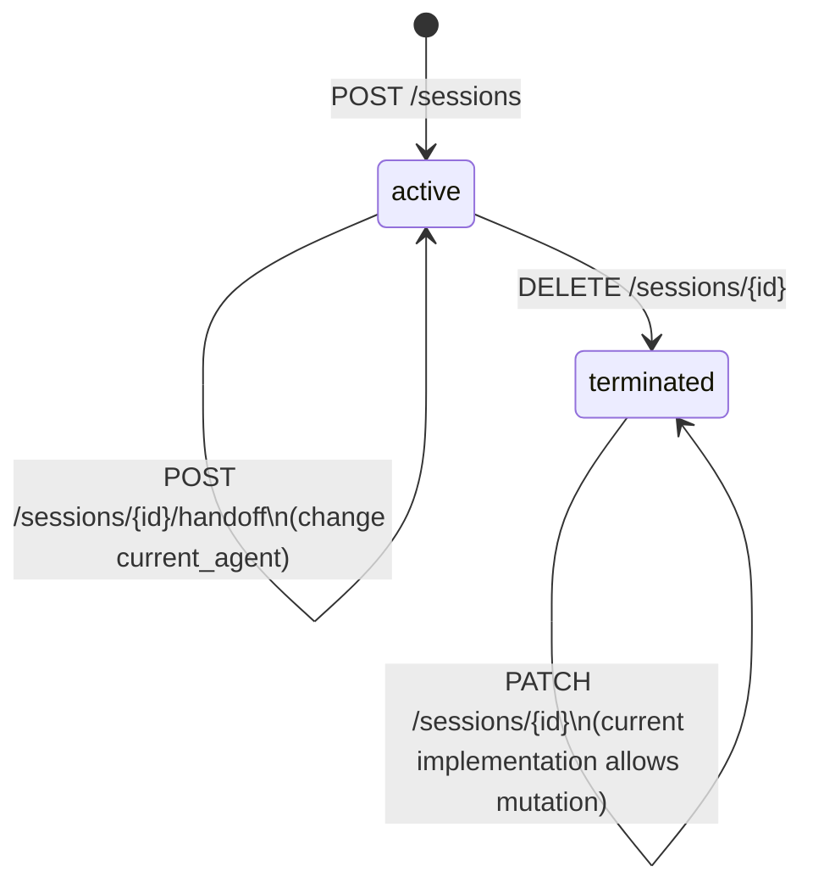

# Session Lifecycle

A session ties an authenticated Keycloak identity to one or more agent invocations. This page documents the currently implemented lifecycle.

## States

| State | Meaning |
|---|---|
| `active` | Session is live; an agent is currently assigned |
| `terminated` | Session has ended; no further mutations are allowed |

## Lifecycle transitions



> Note: `DELETE /sessions/{id}` is a logical terminate operation. The record remains in Redis with `status = terminated`.

## Session object

```json
{
  "id": "3f7a1b2c-...",
  "user_id": "keycloak-sub-claim",
  "user_email": "user@example.com",
  "roles": ["agent-user"],
  "current_agent": "agent-alpha",
  "state": {},
  "status": "active",
  "created_at": "2026-06-18T10:00:00Z",
  "updated_at": "2026-06-18T10:05:00Z"
}
```

`state` is a free-form JSON object that agents use to pass context between each other during handoffs.

Identity fields are derived from JWT claims as follows:

- `user_id` from `sub`
- `user_email` from `email`
- `roles` from `realm_access.roles`

## Handoff pattern

When an orchestrator routes a conversation to a different agent, it calls:

```http
POST /sessions/{id}/handoff
Content-Type: application/json
Authorization: Bearer <token>

{ "target_agent": "agent-beta" }
```

The `current_agent` field is updated atomically in Redis. Both the originating and target agents can read the session to understand the full context.
